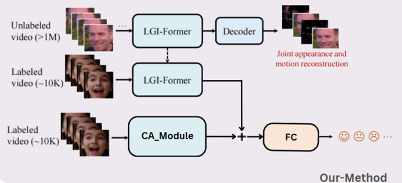
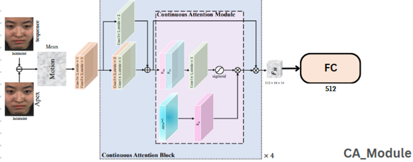
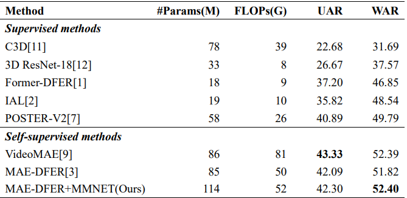

# MAE-DFER-CA: Combination with Efficient Masked Autoencoder for Self-supervised Dynamic Facial Expression Recognition and CA_Module

> National Taiwan University of Science and Technology & Department of Computer Science and Information Engineering<br>

## 📰 News


## ✨ Overview

Dynamic Facial Expression Recognition (DFER) is facing **supervised dillema**. On the one hand, current efforts in DFER focus on developing *various* deep supervised models, but only achieving *incremental* progress which is mainly attributed to the *longstanding lack* of large-scale high-quality datasets. On the other hand, due to the *ambiguity* and *subjectivity* in facial expression perception, acquiring large-scale high-quality DFER samples is pretty *time-consuming* and *labor-intensive*. Considering that there are massive unlabeled facial videos on the Internet, this work aims to **explore a new way** (i.e., self-supervised learning) which can fully exploit large-scale *unlabeled* data to largely advance the development of DFER. We also added **CA_Module** to learn muscle motion between video frames. By learning motion pattern features, we can easily enhance performance.

<p align="center">
   <br>
  Overview of our MAE-DFER+CA_Module.
</p>

Inspired by recent success of VideoMAE, MAE-DFER makes an early attempt to devise a novel masked autoencoder based self-supervised framework for DFER. It improves VideoMAE by developing an *efficient* LGI-Former as the encoder and introducing *joint* masked appearance and motion modeling. With these two core designs, MAE-DFER *largely* reduces the computational cost (about 38% FLOPs) during fine-tuning while having comparable or even *better* performance.

<p align="center">
   <br>
  The architecture of LGI-Former.
</p>
<!--  -->
Inspired by the success of MMNET(Micro-expression), we changed the input of CA_Module to make it learn the difference between the first frame and each frame. Make sure we can learn the motion pattern features of whole videos.
<p align="center">
   <br>
  The architecture of CA_Module.
</p>
Extensive experiments on one DFER datasets show that our MAE-DFER-CA **consistently** outperforms the MAE-DFER.

## 🚀 Main Results

### ✨ FERV39k




## 🔨 Installation

Main prerequisites:

* `Python 3.8`
* `PyTorch 1.7.1 (cuda 10.2)`
* `timm==0.4.12`
* `einops==0.6.1`
* `decord==0.6.0`
* `scikit-learn=1.1.3`
* `scipy=1.10.1`
* `pandas==1.5.3`
* `numpy=1.23.4`
* `opencv-python=4.7.0.72`
* `tensorboardX=2.6.1`

If some are missing, please refer to [environment.yml](environment.yml) for more details.


## ➡️ Data Preparation

Please follow the files (e.g., [ferv39k.py](preprocess/ferv39k.py)) in [preprocess](preprocess) for data preparation.

Specifically, you need to enerate annotations for dataloader ("<path_to_video> <video_class>" in annotations). 
The annotation usually includes `train.csv`, `val.csv` and `test.csv`. The format of `*.csv` file is like:

```
dataset_root/video_1  label_1
dataset_root/video_2  label_2
dataset_root/video_3  label_3
...
dataset_root/video_N  label_N
```

An example of [train.csv](saved/data/ferv39k/all_scenes/train.csv) is shown as follows:

```
/home/drink36/Desktop/Dataset/39K/Face/Action/Happy/0267 0
/home/drink36/Desktop/Dataset/39K/Face/Action/Happy/0316 0
/home/drink36/Desktop/Dataset/39K/Face/Action/Happy/0090 0
```

## 📍Pre-trained Model

Download the model pre-trained on VoxCeleb2 from [this link](https://drive.google.com/file/d/1nzvMITUHic9fKwjQ7XLcnaXYViWTawRv/view?usp=sharing) and put it into [this folder](saved/model/pretraining/voxceleb2/videomae_pretrain_base_dim512_local_global_attn_depth16_region_size2510_patch16_160_frame_16x4_tube_mask_ratio_0.9_e100_with_diff_target_server170).

## ⤴️ Fine-tuning with pre-trained models

- FERV39K

    ```
    bash scripts/ferv39k/finetune_local_global_attn_depth16_region_size2510_with_diff_target_164.sh
    ```
  
    The fine-tuning checkpoints and logs for the four different methods of combining CA_Module and MAE-DFER on FERV39K are as follows:
    | Method   | UAR        | WR       |      Fine-tuned   Model            |
    | :------: | :--------: | :------: | :-----------------------:          |
    | add      | 42.30      | 52.40    | [log](saved/model/finetuning/ferv39k/add/nohup.out) / [checkpoint](https://drive.google.com/drive/folders/1DLdfTPgA321QE9rwFNBBGNilN6GKwKrA?usp=drive_link) | 
    | add(4*5) | 41.00      | 51.33    | [log](saved/model/finetuning/ferv39k/add(4*5*10)/nohup.out) / [checkpoint](https://drive.google.com/drive/folders/1lspg-3_DpYoJFqWUg3ZIzhUZUJ6c_SU5?usp=drive_link) | 
    | add(pos) | 42.02      | 52.08    | [log](saved/model/finetuning/ferv39k/add(pos)/nohup.out) / [checkpoint](https://drive.google.com/drive/folders/1EWtMHXcJQ-0PsBeDoXMHueceaJLB4aEb?usp=drive_link) | 
    | cat      | 42.20      | 52.30    | [log](saved/model/finetuning/ferv39k/cat/nohup.out) / [checkpoint](https://drive.google.com/drive/folders/1DLdfTPgA321QE9rwFNBBGNilN6GKwKrA?usp=drive_link) |

## ☎️ Contact 

If you have any questions, please feel free to reach me out at `ooo910809@gmail.com`.

## 👍 Acknowledgements

This project is built upon [VideoMAE](https://github.com/MCG-NJU/VideoMAE), [MAE-DFER](https://github.com/sunlicai/MAE-DFER) and [MMNET](https://github.com/muse1998/MMNet). Thanks for their great codebase.

